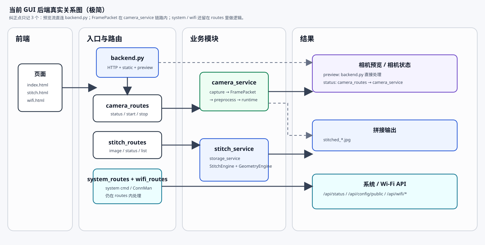

# 02 架构说明

## 简版关系图



位图导出：`docs/assets/gui-runtime-architecture.png`

## 只记这几个关键关系

- `camera_routes.py` 进入 `camera_service.py`，`FramePacket` 也在这条链路里产生，不在 routes。
- `/api/camera/stream` 和 `/api/camera/frame.jpg` 由 `backend.py` 直接处理（`Handler.send_camera_stream()` / `Handler.send_camera_frame_jpeg()`），数据来自 `camera_service.get_camera_stream_frame()` 的运行时缓存。
- `stitch_routes.py` 进入 `stitch_service.py`，拼接时会带上 `storage_service.py`、`StitchEngine` 和 `GeometryEngine`；`/api/stitch/logs` 则直接读 `stitch_diagnostics.py` 的进程内报告环。
- `system_routes.py` 和 `wifi_routes.py` 现在都还保留 route-local logic，不是纯粹转发到 service；`wifi_routes.py` 直接实现 ConnMan 交互，`system_routes.py` 直接跑 `hostname`/`uname`/`ip` 等命令。
- `camera_service.stop_camera_session()` 在拍到 ≥2 张图时会直接调用 `stitch_service.run_image_stitch()`（传 `source="camera"`），所以相机和静态图片共用同一套拼接流程与同一套诊断日志。

## 当前代码分层

```text
backend.py                 # HTTP / static / 预览流（MJPEG + 单帧 JPEG）
app/config.py              # config.json 加载、归一化、导出常量
app/schemas.py             # FramePacket / ProcessedFrame
app/routes/                # camera / stitch / system / wifi 的 JSON 路由分发
app/services/              # camera / stitch / storage / geometry / preprocess / keyframe
                           # + metrics（/proc、/sys 采样）+ stitch_diagnostics（拼接报告）
app/capture/               # gst_capture / gst_raw_nv12_capture / v4l2_capture
app/preprocess/            # cpu_engine / rga_engine
app/geometry/              # cpu_geometry / opencl_geometry / opencl_runtime
app/selector/              # off_selector / cpu_selector / rknn_selector
app/stitch_engine/         # common / opencv_engine / sequential_engine / scans_engine
app/utils/                 # log / timing
native/rga/                # libmyui_rga.so 的 C++ wrapper 源码与 Makefile
tests/                     # unit / integration / smoke / benchmark
vendor/pannellum/          # 离线 Pannellum 2.5.7
index.html stitch.html wifi.html stitch_log.html   # 四个无框架页面
```

## HTTP 分发顺序

`backend.py` 中的路由是显式元组，按顺序尝试，第一个返回非 `None` 的处理器胜出：

```text
GET_ROUTES  = system_routes.handle_get, wifi_routes.handle_get, stitch_routes.handle_get, camera_routes.handle_get
POST_ROUTES = system_routes.handle_post, wifi_routes.handle_post, camera_routes.handle_post, stitch_routes.handle_post
```

`do_GET()` 的实际优先级是：

1. `/` 重写为 `/index.html`，交给 `SimpleHTTPRequestHandler`
2. `/api/camera/frame.jpg`（支持 `session_id`、`after` 查询参数）
3. `/api/camera/stream`（支持 `session_id`，会话不匹配返回 404）
4. 上面四个 `handle_get`
5. `config.STITCH_INPUT_URL_PREFIX` / `STITCH_OUTPUT_URL_PREFIX` 前缀的静态图片（带 `..`、绝对路径、越界检查）
6. 其余交给默认静态文件处理

## 引擎装配位置

引擎不是在 routes 里 new 出来的，而是由 service 层的单例工厂创建：

- `app/services/preprocess_service.py:get_preprocess_engine()`：`accel.preprocess=rga` → `RgaPreprocessEngine`，否则 `CpuPreprocessEngine`。
- `app/services/geometry_service.py:get_geometry_engine()`：`accel.geometry=opencl` → `OpenCLGeometryEngine`，否则 `CpuGeometryEngine`。
- `app/services/keyframe_service.py:get_selector()`：`cpu_basic` → `CpuSelector`，`rknn` → `RknnSelector`，否则 `OffSelector`。
- `app/services/stitch_service.py:get_stitch_engine()`：`sequential` → `SequentialPanoEngine`（fallback 为 `OpenCVStitchEngine`），`scans` → `ScansStitchEngine`，其余 → `OpenCVStitchEngine`。`script` 引擎不走这里，而是在 `run_image_stitch()` 里调用 `run_stitch_script()`。

这四个工厂都是模块级单例，进程内只创建一次，因此改 `config.json` 后需要重启后端。

## 相机会话内部结构

`camera_service.py` 用一个模块级 `CAMERA_RUNTIME` 字典加 `CAMERA_RUNTIME_LOCK` 维护单会话状态，`start_camera_session()` 会拉起两个 daemon 线程：

- `_camera_capture_loop()`：打开采集设备、循环读帧、把最新帧存成 `FramePacket`；`mode=auto` 时按 `auto_interval_sec` 触发 `process_for_save()` → `selector.decision()` → 保存或计入 `dropped_count`。
- `_camera_preview_encode_loop()`：按 `preview_fps` 节流，调用 `process_for_preview()` 生成 `preview_jpeg`，写入 `last_frame_jpeg` 供 `/api/camera/stream` 与 `/api/camera/frame.jpg` 读取。

`require_rga=true` 时，`_enforce_required_rga()` 会在 `mode_tag != "rga_active"` 时抛错，用于生产验收防止静默 fallback。

## 拼接诊断链路

`run_image_stitch()` 在引擎调度外面包了一层诊断，代码位置 `app/services/stitch_service.py` 与 `app/services/stitch_diagnostics.py`：

```text
run_image_stitch()
  -> StitchDiagnostics(request_id, source, image_paths, config_snapshot)
       config_snapshot = requested_engine + auto_crop + geometry/preprocess/backend 三个 status
  -> with diagnostics.stage("engine_dispatch", ...)
       script 引擎  -> run_stitch_script()，engine_detail 只记 script_path/timeout
       其他引擎      -> stitch_image_files() -> engine.get_last_run_detail()
  -> diagnostics.finish(ok, message, output_path, engine_detail)
       前后各做一次 metrics_service.snapshot()，算 CPU/内存/GPU/温度差异
  -> 报告存入进程内 deque(maxlen=30)，并随响应返回 log_id + stitch_log
```

引擎侧的阶段数据来自 `StitchEngine` 基类新增的三个方法（`app/stitch_engine/base.py`）：

- `_begin_run_detail(image_paths, auto_crop)`：每次 `stitch()` 开头重置 `self.last_run_detail`。
- `_record_stage(name, started, **detail)`：追加一条带 `elapsed_ms` 的阶段记录。
- `get_last_run_detail()`：返回 deepcopy，供 service 层取用。

注意 `last_run_detail` 是引擎实例属性，而引擎是模块级单例，所以它只保留**最近一次**运行的数据；跨请求的历史要从 `stitch_diagnostics` 的报告环取。并发拼接时两个请求会互相覆盖这个字段，当前实现没有加锁保护。
